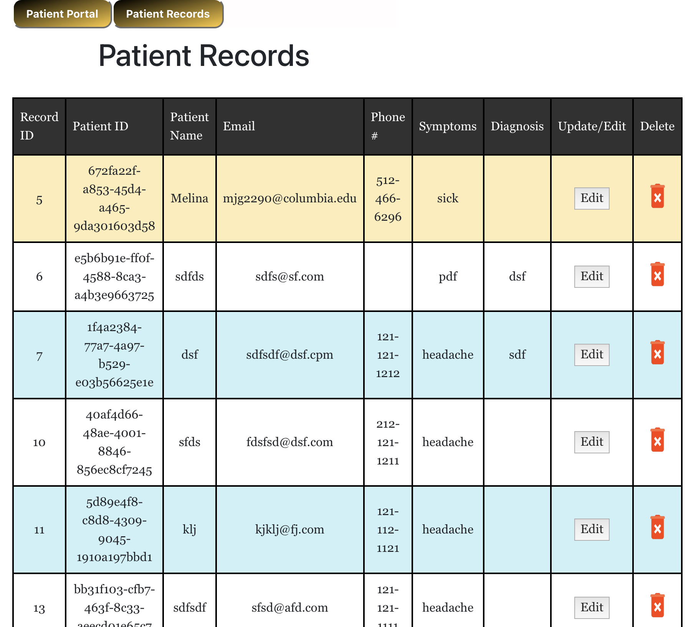

# django-healthbot
HealthChatbot website written in Django + React

     

Instructions
1. Download the project
2. In the terminal, cd into the directory (cd django-health-chatbot)
3. Start up the virtual environment, run : pipenv shell

 pip install -r requirements.txt
 python manage.py migrate
 
4. In the virtual environment run,  python3 manage.py runserver 8080
5. Go to http://127.0.0.1:8000/ in browser to access application
