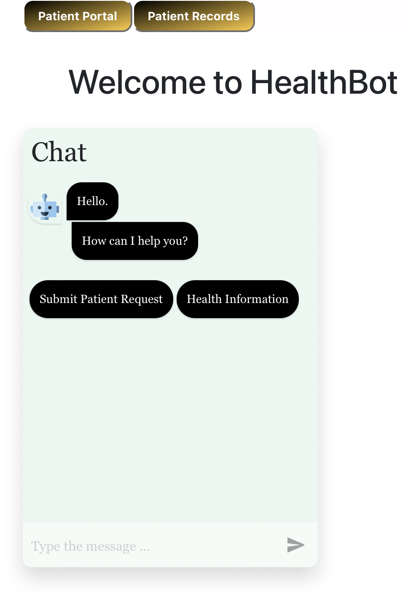

# django-healthbot
<h2>HealthChatbot website written in Django + React</h2>

<li align="center">PatientPortal to submit a request</li>
<li align="center">PatientRecords to view patient records</li>

  
   

Instructions
1. Download the project(Code, Download ZIP)

(If necessary, unzip the folder, extract all, and leave it in the Downloads folder)
(If necessary, install python, pip, and pipenv)

2. In the terminal, cd into the directory, until you see manage.py in directory (cd, cd Downloads, cd django-healthbot-main)
3. Start up the virtual environment, run : pipenv shell
(if in Windows run: pipenv --python 3.11.1, then pipenv shell)
4. Install requirements: pip install -r requirements.txt
5. In the virtual environment run:  python3 manage.py runserver 8080 or python manage.py runserver 8080
6. Go to http://127.0.0.1:8080/ in browser to access application

